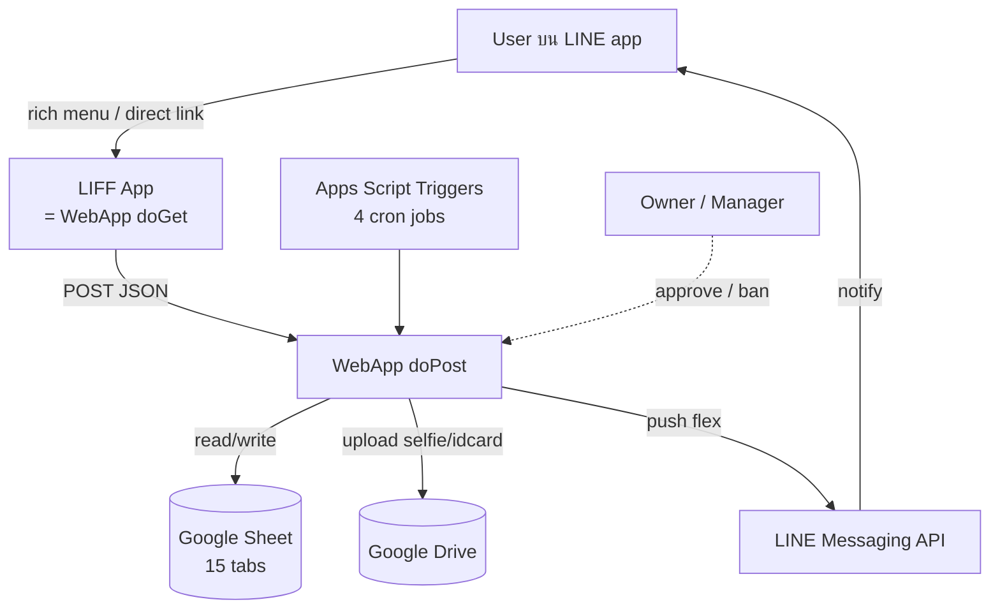
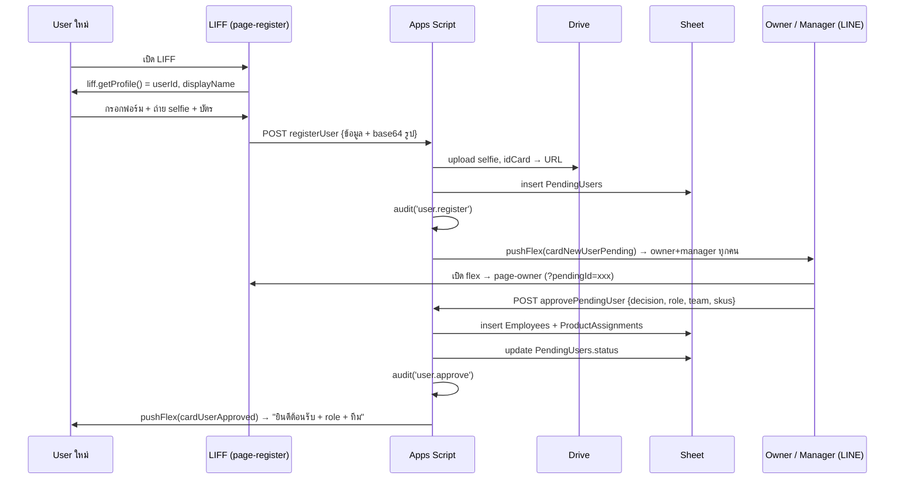

# Architecture — TikTok CRM Lead Manager

## 1. ภาพรวม



ทั้งหมดอยู่ใน **Apps Script project เดียว** — ไม่มี external host

## 2. Flow หลัก 6 ตัว

### Flow 1 — New User Onboarding



### Flow 2 — Staff โทร

```
1. 09:00 cron → push flex morning queue (ข้ามคนลา)
2. staff เปิด → ดูคิว (sorted by due_date)
3. กด lead → ดู detail + script
4. กดคัดลอกเบอร์ → log
5. โทร (tel:) → log
6. กดผลโทร 1 ใน 6
7. ระบบ update Leads + Customers + CallLogs + audit
```

### Flow 3 — Assignment (product-based)

```
input: orders ใน Lead (มี SKU)
       customer (มีหรือไม่มี owner)

1) primary_sku = SKU ของ order แรกใน lead
2) candidates = Employees where:
   - active=TRUE, banned=FALSE
   - มี row ใน ProductAssignments(sku=primary_sku, is_active=TRUE)
   - ไม่ลาในวันนี้ (Leaves)
3) ถ้า customer.owner_employee_id ∈ candidates → ใช้
4) ถ้าไม่ → round-robin (rr_pointer ใน Config)
5) ถ้า candidates ว่าง → fallback:
   - manager ที่ active+ไม่ลา (เรียงตาม joined_at)
   - หรือ owner คนแรก
   - assignment_reason = 'fallback_no_candidate'
6) audit log
```

### Flow 4 — Leave

```
1. staff → page-leave → กรอก start, end, type, reason
2. POST requestLeave
3. ระบบ:
   - insert Leaves(status=pending)
   - หา approver: lead ของทีม → ถ้าไม่มี → manager → ถ้าไม่มี → owner
   - pushFlex(cardLeaveRequest) → approver
4. approver กดอนุมัติ:
   - update Leaves.status='approved'
   - pushFlex → user "อนุมัติแล้ว"
5. ถ้า start_date = วันนี้/ผ่านแล้ว:
   - cron tickSLA จะ reassign lead ของคนนี้
```

### Flow 5 — Ban

```
1. owner → page-owner → tab Employees → กด ban
2. confirm dialog → ใส่เหตุผล
3. POST banEmployee
4. ระบบ:
   - update Employees.is_banned=TRUE, ban_reason, banned_at
   - update ProductAssignments.is_active=FALSE (ทุก row ของคนนี้)
   - หา leads pending ของคนนี้ → reassign (Assign.gs)
   - update Customers.owner_employee_id = '' (ทุกคนที่ผูกอยู่)
   - audit('user.ban')
   - pushFlex(cardBanned, reason) → user
```

### Flow 6 — Audit Trail

ทุก mutation:
1. function เรียก `audit(action, ...)` ก่อน return
2. เขียน Sheet AuditLog ทันที (sync)
3. owner เปิด `page-owner` tab `Audit` → ดู log:
   - filter by action, actor, target_type, date range
   - export CSV

## 3. Setup Plan (พี่ปุ้ยทำเอง)

1. เปิด script.google.com → New project
2. clasp push code ทุกไฟล์ (หรือ paste ใน UI)
3. Run `setupAll()` → permission → ได้ Sheet URL
4. Deploy Web App → URL
5. สร้าง LINE OA + LIFF (Endpoint = URL?page=app)
6. รัน `setLiffId(...)`, `setLineAccessToken(...)`, `addOwner(myLineId)`
7. Run `runAllTests()` ตรวจ
8. ส่ง LIFF URL ให้พนักงาน → register → owner approve

## 4. Edge Cases

| สถานการณ์ | จัดการ |
|---|---|
| Drive upload fail (เน็ตขาด) | retry 3 ครั้ง + return error → user ลองใหม่ |
| 2 owner approve user เดียวกันพร้อมกัน | `withLock()` ครอบ approvePendingUser |
| Staff ลาขณะมี lead pending | cron tickSLA เห็น `isOnLeaveToday` → reassign |
| ทุก staff ใน SKU เดียวกันลา | fallback → manager → owner |
| Owner ban ตัวเอง | block ใน function (เช็ค actorId ≠ targetId) |
| LIFF เปิดบน desktop (no camera) | `<input type="file" accept="image/*">` ไม่มี capture → user เลือกรูป |
| CSV ใหญ่ timeout | batch 50 rows + SpreadsheetApp.flush() |
| Race ตอน assign (2 csv import พร้อมกัน) | `withLock()` ครอบ resolveOwner + roundRobinPick |
| LINE push 429 | retry 3x exponential backoff |

## 5. File Structure → Phase Map

| File | Phase |
|---|---|
| Setup.gs, Utils.gs, Logger.gs, Auth.gs, WebApp.gs | 1 |
| Audit.gs | 2 |
| Onboarding.gs + page-register | 3 |
| ProductAssign.gs + Assign.gs | 4 |
| Leave.gs + page-leave | 5 |
| Lead.gs, TeamLead.gs, Manager.gs, Owner.gs | 6 |
| Import.gs | 7 |
| FlexCard.gs, LineApi.gs | 8 |
| Reminder.gs | 9 |
| _styles, _app, page-* | 10 |
| Tests.gs | 11 |
